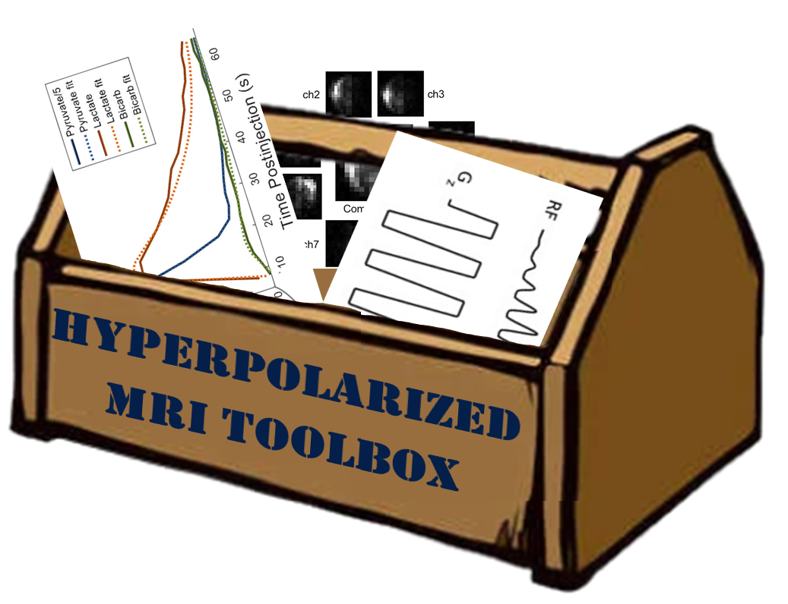

# hyperpolarized-mri-toolbox



The goal of this toolbox is to provide research-level and prototyping software tools for hyperpolarized MRI experiments. It is currently based on MATLAB code, and includes code for designing radiofrequency (RF) pulses, readout gradients, data reconstruction, and data analysis.

It is hosted on this open-source, collaborative platform in order to encourage anyone and everyone in the hyperpolarized MRI research community to contribute tools that will help our field rapidly progress.

## Citations

```
Hyperpolarized-MRI-Toolbox.
Available online at: https://github.com/LarsonLab/hyperpolarized-mri-toolbox
https://dx.doi.org/10.5281/zenodo.1198915
```

```
Crane, JC, Gordon, JW, Chen, H-Y, Autry AW, Li Y, Olson MP, Kurhanewicz J, Vigneron DB, Larson PEZ, Xu D.
Hyperpolarized 13C MRI data acquisition and analysis in prostate and brain at University of California, San Francisco.
NMR in Biomedicine. 2021; 34:e4280. https://doi.org/10.1002/nbm.4280
```

## Getting Started

1. Download latest release (at right) and extract or clone git repository (via 'Code' at the top)
1. Open Matlab or Octave
1. Navigate to the `hyperpolarized-mri-toolbox/` directory 
1. Run `startup`.  This will setup path and confirm you have required toolboxes

### Examples and Exercises

There are starter code and examples in
* `hyperpolarized-mri-toolbox/demo_notebooks/` 
* `hyperpolarized-mri-toolbox/RF_pulses/spectral_spatial/examples/`

There are also several exercises to learn working with the data, analysis functions, and spectral-spatial RF pulse design in
* `hyperpolarized-mri-toolbox/exercises/` 

### MyBinder online demos

You can also run the demo jupyter notebooks online without installing or downloading the code through MyBinder:

[](https://mybinder.org/v2/gh/LarsonLab/hyperpolarized-mri-toolbox/master?filepath=demo_notebooks)

Note that it may take several minutes to build if this has not been used in a while.

### Requirements

#### MATLAB

Toolboxes: Optimization, Image Processing, Statistics and Machine Learning

#### Octave

Toolboxes: ptim, image, io, statistics, signal

Missing functionality in Octave in spectral-spatial RF pulse design

## Hyperpolarized Metabolic MRI Seminar

For general education on hyperpolarzed carbon-13 metabolic MRI, lectures and slides from the UCSF Hyperpolarized MR Seminar (summer 2019) are available
*  (HP MRI Course 2021) https://hyperpolarizedmri.ucsf.edu/hp-mri-course-2021
*  (HP MRI Course 2019) https://www.youtube.com/playlist?list=PLjBt5Iq93BT-vODpVTT5R-uOB-MYaSZOn
*  https://www.slideshare.net/PederLarson1

## Related Tools

### Visualization and Implemented Pipelines: SIVIC

This toolbox is jointly developed with the Spectrscopic Imaging VIsualization and Computing (SIVIC) framework (https://sourceforge.net/projects/sivic/), which is also hosted on [github](https://github.com/SIVICLab/sivic).
While this toolbox focuses on prototyping new methods, leveraging the flexibility of MATLAB to rapidly perform this work, while SIVIC is focused on deployment of methods once they have been validated and also has focused on providing data visualization tools (e.g. mix of spectroscopy, imaging, 1H reference images, and parameter maps).  SIVIC is more suited for use in routine hyperpolarized MR studies.

### Pulse Sequences

The UCSF Hyperpolarized MRI Technology Resource Center (https://hyperpolarizedmri.ucsf.edu/, NIH Grant P41-EB013598) has specialized hyperpolarized 13C pulse sequences available, including Metabolite-specific EPI (GE), Metabolite-specific Spirals with real-time calibration (RTHawk) as well as several for Bruker and Varian small animal systems.  Please reach out through the center for more information.

Many of these are distributed through the UCSF-HMTRC GitHub organization, https://github.com/UCSF-HMTRC.


### Spectral-Spatial-RF-Pulse-Design toolbox

This includes, as a subtree, the
[Spectral-Spatial-RF-Pulse-Design toolbox](https://github.com/LarsonLab/Spectral-Spatial-RF-Pulse-Design) for hyperpolarized MRI RF pulse design.  For reference, here's how to update the subtree with git:

(run from root directory of hyperpolarized-mri-toolbox)

    git subtree add --prefix RF_pulses/spectral_spatial https://github.com/LarsonLab/Spectral-Spatial-RF-Pulse-Design.git master --squash
    git subtree pull --prefix RF_pulses/spectral_spatial https://github.com/LarsonLab/Spectral-Spatial-RF-Pulse-Design.git master --squash
    git subtree push --prefix RF_pulses/spectral_spatial https://github.com/LarsonLab/Spectral-Spatial-RF-Pulse-Design.git master --squash

## Support

This toolbox was created as a part of the UCSF Hyperpolarized MRI Technology Resource Center (https://hyperpolarizedmri.ucsf.edu/) which is funded by the National Institutes of Health (NIH Grant P41-EB013598).

Please let us know if you would like to contribute or have suggestions for content, contact Peder Larson, University of California - San Francisco


