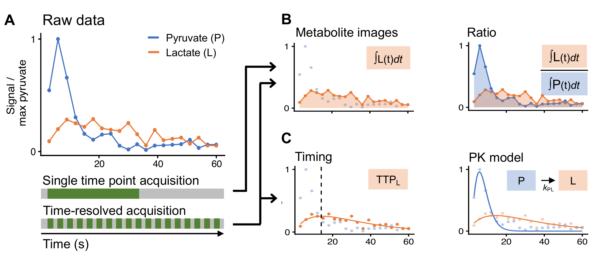

# Analysis Methods for Hyperpolarized MRI

This folder contains methods for analyzing hyperpolarized MRI, with the primary goal of producing metrics derived from dynamic, time-series data.  
These generally fall under the category of pharmacokinetic modeling (also known as kinetic modeling) and model-free metrics.

These are written with hyperpolarized [1-13C]pyurvate in mind, although have potentially simple adaptations for other agents.

General textbook reference:

James Bankson, Peder E.Z. Larson,
6 - Analysis and visualization of hyperpolarized 13C MR data,
Editor(s): Peder E.Z. Larson,
Advances in Magnetic Resonance Technology and Applications,
Academic Press,
Volume 3,
2021,
Pages 129-155,
ISSN 2666-9099,
ISBN 9780128222690,
https://doi.org/10.1016/B978-0-12-822269-0.00004-X.

## Pharmacokinetic Modeling

This toolbox primarily supports the so-called "Inputless method", whereby an explicit input function is not fit, but rather the input function is derived directly from substrate (e.g. pyruvate).

`fit_pyr_kinetics()` - Inputless method

`fit_pyr_kinetics_and_input()` - Fitting input function

References

**(Fitting Input)**  Matthew L. Zierhut, Yi-Fen Yen, Albert P. Chen, Robert Bok, Mark J. Albers, Vickie Zhang, Jim Tropp, Ilwoo Park, Daniel B. Vigneron, John Kurhanewicz, Ralph E. Hurd, Sarah J. Nelson,
Kinetic modeling of hyperpolarized 13C1-pyruvate metabolism in normal rats and TRAMP mice,
Journal of Magnetic Resonance,
Volume 202, Issue 1,
2010,
Pages 85-92,
ISSN 1090-7807,
https://doi.org/10.1016/j.jmr.2009.10.003.

**(Inputless Method)** Khegai, O., Schulte, R. F., Janich, M. A., Menzel, M. I., Farrell, E., Otto, A. M., Ardenkjaer-Larsen, J. H., Glaser, S. J., Haase, A., Schwaiger, M., and Wiesinger, F. (2014), Apparent rate constant mapping using hyperpolarized [1–13C]pyruvate, NMR Biomed., 27, 1256– 1265, doi: 10.1002/nbm.3174

**(Inputless Method)** Larson, PEZ, Chen, H-Y, Gordon, JW, et al. Investigation of analysis methods for hyperpolarized 13C-pyruvate metabolic MRI in prostate cancer patients. NMR in Biomedicine. 2018; 31:e3997. https://doi.org/10.1002/nbm.3997

## Model-free Metrics

### Area-under-curve (AUC)

`compute_AUCratio()`

Hill DK, Orton MR, Mariotti E, Boult JKR, Panek R, et al. (2013) Model Free Approach to Kinetic Analysis of Real-Time Hyperpolarized 13C Magnetic Resonance Spectroscopy Data. PLOS ONE 8(9): e71996. https://doi.org/10.1371/journal.pone.0071996

### Time-to-peak (TTP)

`compute_TTP()`

Daniels, C. J., McLean, M. A., Schulte, R. F., Robb, F. J., Gill, A. B., McGlashan, N., Graves, M. J., Schwaiger, M., Lomas, D. J., Brindle, K. M., and Gallagher, F. A. (2016) A comparison of quantitative methods for clinical imaging with hyperpolarized 13C-pyruvate. NMR Biomed., 29: 387– 399. doi: 10.1002/nbm.3468.

### Mean Time (MT)

`compute_MT()`

Larson, PEZ, Chen, H-Y, Gordon, JW, et al. Investigation of analysis methods for hyperpolarized 13C-pyruvate metabolic MRI in prostate cancer patients. NMR in Biomedicine. 2018; 31:e3997. https://doi.org/10.1002/nbm.3997
