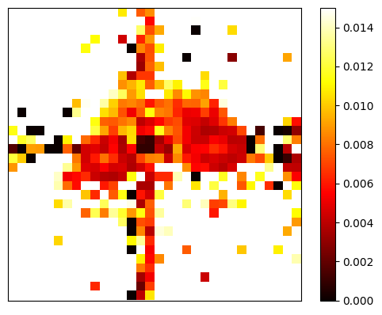

# Analysis Methods for Hyperpolarized MRI - Python tools

This folder contains python implementations of a selection of the matlab tools found in the analysis folder.  

Tested using Python 3.9
Complete environment information can be found in `environment.yml`

## Pharmacokinetic Modeling

`py_fit_pyr_kinetics()` - inputless method pharmacokinetic fitting (python version)

Example usage can be found in `test_py_fit_pyr_kinetics.ipynb`

### Can we recreate the same results as the MATLAB fit_pyr_kinetics using py_fit_pyr_kinetics()?

For the same dataset with the same starting parameters:

MATLAB Implementation      |  Python Implementation
:-------------------------:|:-------------------------:
     |  

## Visualization Tools

`multiframe_imshow()` - matplotlib imshow for high dimensional data
