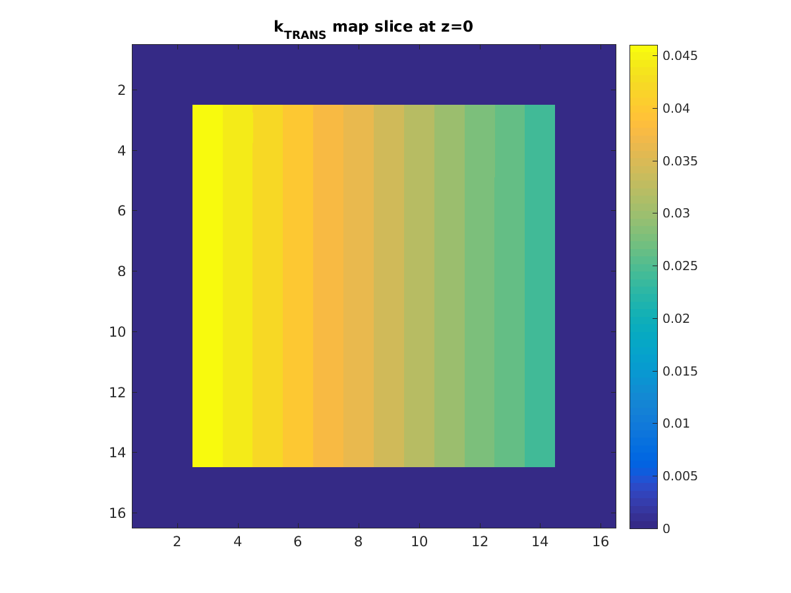
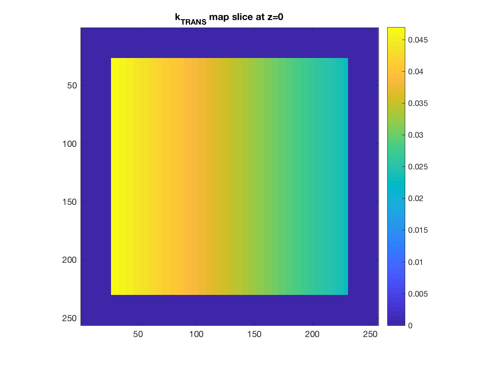
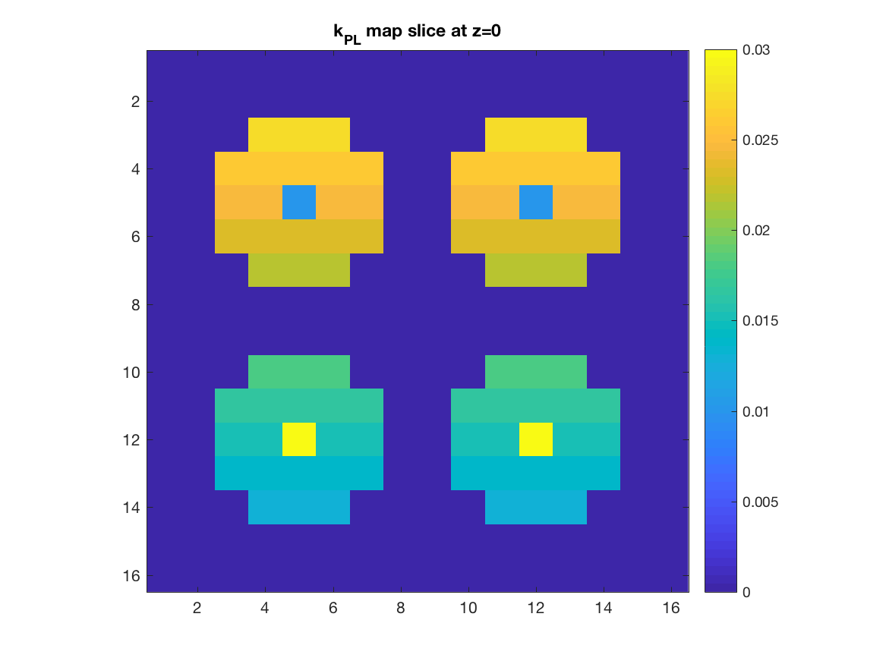
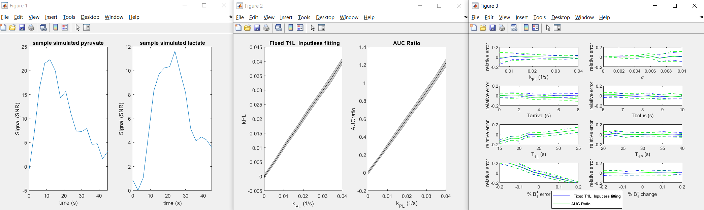

# Hyperpolarized Simulation Tools

## Creating Simulated Data

This directory includes tools for simulating metabolic imaging data based on kinetic models.  These include

`realistic_input_function` - create a gamma-variate function for simulating the bolus input

`simulate_Nsite_model` - simulates up to 4-site kinetic model, with input function for the substrate and inter-conversion between up to 3 products

See [Kinetic Modeling Notebook](../demo_notebooks/Test_Kinetic_Modeling.ipynb) for examples

## Metabolic Phantom

The file metabolic_phantom.m provides a matlab function for automatically generating standardized 3-dimensional perfusion and metabolism maps for simulated experiments. The script DEMO.m demonstrates the usage of this function. Examples of the resulting parameter maps are shown below. 

kTRANS (perfusion) map:

 

kPL (metabolism) map:

 

## Monte Carlo Simulations of Analysis Metrics

Given the experimental challenges of time, cost, and lack of ground truth for HP studies, simulations are an invaluable tool for evaluating data acquisition and analysis strategies.
This toolbox includes a Monte Carlo based simulation tool `HP_montecarlo_evaluation()` which uses a 2-site kinetic model (`simulate_Nsite_model()`) with added noise and your choice of experiment parameters (e.g. flip angles, timings) and analysis metric(s) (e.g. kPL, AUCratios).  
It evalutes the sensitivity of this combination of experiment parameters and analysis metric to changes in kinetic rate, noise level, bolus characteristics, relaxation rates, and B1+ (e.g. flip angle).

Several examples including different acquisition schemes, different kinetic model approaches, and comparison to an AUCratio are in the `test_HP_montecarlo_evaluation.m` script, which has the expected output:



### Examples
```
Larson PEZ, Chen HY, Gordon JW, Korn N, Maidens J, Arcak M, Tang S, Criekinge M, Carvajal L, Mammoli D, Bok R, Aggarwal R, Ferrone M, Slater JB, Nelson SJ, Kurhanewicz J, Vigneron DB. Investigation of analysis methods for hyperpolarized 13C-pyruvate metabolic MRI in prostate cancer patients. NMR Biomed. 2018 Nov;31(11):e3997.
https://doi.org/10.1002/nbm.3997. Epub 2018 Sep 19. PMID: 30230646; PMCID: PMC6392436.
```
* See Figures 4-6

```
James Bankson, Peder E.Z. Larson, Analysis and visualization of hyperpolarized 13C MR data, Editor(s): Peder E.Z. Larson, Advances in Magnetic Resonance Technology and Applications, Academic Press,
Volume 3, 2021, Pages 129-155, ISSN 2666-9099, ISBN 9780128222690, https://doi.org/10.1016/B978-0-12-822269-0.00004-X
```
* Figures 6.8 and 6.9

## Bicarbonate pH Simulation

Simulates the effect of pulse sequence parameters (flip angles, phase encoding, etc) on pH measurements for HP bicarbonate studies. Based on:

```
Korenchan, DE, Gordon, JW, Subramaniam, S, et al. Using bidirectional chemical exchange for improved hyperpolarized [13C]bicarbonate pH imaging. Magn Reson Med. 2019; 82: 959–972. doi: 10.1002/mrm.27780
```
https://doi.org/10.1002/mrm.27780
##
