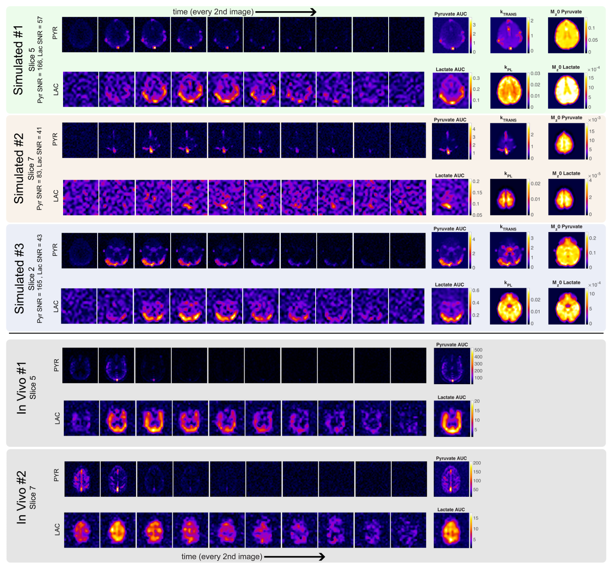

# Anatomical Phantom Toolkit

## Brain Phantom (based on BrainWeb)

`brainweb_metabolic_phantom` - function to generate metabolic phantom instances with random spatial augmentations

`brainweb_metabolic_phantom_test` - example of testing and visualizing the brainweb metabolic phantom function

`brainweb_metabolic_phantom_generate_data` - another example of using the brainweb metabolic phantom function to create training data with realistic parameter ranges and save the examples as HDF5 files

Example Phantom Data Compared with In Vivo:

## Cardiac Phantom (based on Cardiac Atlas Project)

`cardiac_metabolic_phantom` - function to generate metabolic phantom instances with random spatial augmentations

`cardiac_metabolic_phantom_test` - example of testing and visualizing the cardiac metabolic phantom function

Example Phantom Data Compared with In Vivo:

### References
1. Aubert-Broche B, Evans AC, Collins L. A new improved version of the realistic digital brain phantom. NeuroImage. 2006;32(1):138-145. doi:10.1016/j.neuroimage.2006.03.052
1. Berengere Aubert-Broche, Griffin M, Pike GB, Evans AC, Collins DL. Twenty New Digital Brain Phantoms for Creation of Validation Image Data Bases. IEEE Trans Med Imaging. 2006;25(11):1410-1416. doi:10.1109/TMI.2006.883453
1. Cocosco C, Kollokian V, Kwan R, Evans A. BrainWeb: Online Interface to a 3D MRI Simulated Brain Database. NeuroImage. Published online 1997. Accessed April 17, 2024. https://www.semanticscholar.org/paper/BrainWeb%3A-Online-Interface-to-a-3D-MRI-Simulated-Cocosco-Kollokian/2bb7426e6ecdab0f120c89f6a324cf0c2a7266d4
1. Collins DL, Zijdenbos AP, Kollokian V, et al. Design and construction of a realistic digital brain phantom. IEEE Trans Med Imaging. 1998;17(3):463-468. doi:10.1109/42.712135
1. Kwan RKS, Evans AC, Pike GB. MRI simulation-based evaluation of image-processing and classification methods. IEEE Trans Med Imaging. 1999;18(11):1085-1097. doi:10.1109/42.816072
1. Kwan R, Evans A, Pike G. An Extensible MRI Simulator for Post-Processing Evaluation. In: Proceedings of the 4th International Conference on Visualization in Biomedical Computing. Springer-Verlag; 1996:135-140.
1. BrainWeb: Simulated Brain Database. Accessed April 17, 2024. https://brainweb.bic.mni.mcgill.ca/brainweb/
1. Fonseca CG, Backhaus M, Bluemke DA, et al. The Cardiac Atlas Project—an imaging database for computational modeling and statistical atlases of the heart. Bioinformatics. 2011;27(16):2288-2295. doi:10.1093/bioinformatics/btr360
1. Petersen SE, Aung N, Sanghvi MM, et al. Reference ranges for cardiac structure and function using cardiovascular magnetic resonance (CMR) in Caucasians from the UK Biobank population cohort. J Cardiovasc Magn Reson. 2016;19(1):18. doi:10.1186/s12968-017-0327-9
1. Mauger C, Gilbert K, Lee AM, et al. Right ventricular shape and function: cardiovascular magnetic resonance reference morphology and biventricular risk factor morphometrics in UK Biobank. J Cardiovasc Magn Reson. 2019;21(1):41. doi:10.1186/s12968-019-0551-6
1. Cardiac Atlas Project: Biventricular PCA Modes (UK Biobank). Accessed June 17, 2024. https://www.cardiacatlas.org/biventricular-modes/
